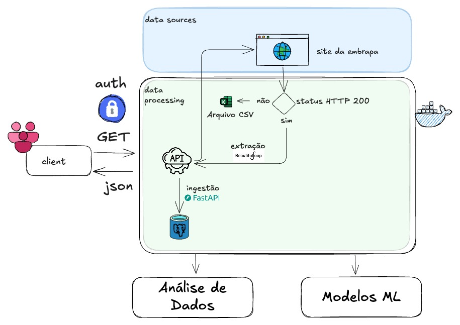

# 📘 Embrapa Vitivinicultura API

A RESTful API desenvolvida com **FastAPI** que disponibiliza dados vitivinícolas provenientes do site da Embrapa Uva e Vinho, com fallback em arquivos CSV. O projeto inclui autenticação JWT, banco PostgreSQL, scraping com BeautifulSoup, testes automatizados, logging estruturado, protótipo de modelo de Machine Learning e análise exploratória em notebooks Jupyter. Hospedada no Render com documentação via Swagger.

---

## 📌 Sobre o Projeto

Este repositório corresponde à entrega final da primeira fase do curso de pós-graduação em Engenharia de Machine Learning. Ele tem como objetivo consolidar boas práticas de desenvolvimento backend, integração com dados públicos, modelagem preditiva e entrega em ambiente de produção.

### 📚 Fontes de dados:

* **Site da Embrapa** com scraping de dados atualizados sobre vitivinicultura
* **Fallback local** em arquivos CSV organizados por tipo de dado

---

## ⚙️ Tecnologias Utilizadas

| Tecnologia     | Função                                        |
| -------------- | --------------------------------------------- |
| FastAPI        | Framework principal da API REST               |
| SQLAlchemy     | ORM para PostgreSQL                           |
| Alembic        | Migrações do banco de dados                   |
| PostgreSQL     | Banco de dados relacional (Render)            |
| BeautifulSoup  | Web scraping do site da Embrapa               |
| Pandas         | Manipulação de dados tabulares                |
| Poetry         | Gerenciamento de dependências e ambiente      |
| Pytest         | Testes automatizados                          |
| Docker         | Containerização e execução isolada            |
| Jupyter        | Análise de dados e treinamento do modelo ML   |

---

## 📁 Estrutura do Projeto

```bash
embrapa_api/
├── app/
│   ├── auth/             # Autenticação JWT e hashing de senha
│   ├── core/             # Configurações de ambiente e sessão DB
│   ├── logging/          # Logging estruturado com rotação
│   ├── models/           # Modelos ORM do SQLAlchemy
│   ├── repositories/     # Camada de acesso a dados
│   ├── routes/           # Endpoints organizados por domínio
│   ├── schemas/          # Modelos Pydantic (entrada/saída)
│   ├── services/         # Lógica de negócio e scraping
│   └── main.py           # Inicialização da API FastAPI
├── alembic/              # Scripts de migração do banco
├── data/                 # CSVs de fallback para scraping
├── docs/                 # Documentos auxiliares
│   └── architecture.jpeg # Diagrama da arquitetura da API
├── notebooks/            # Notebooks de EDA e ML
├── scripts/              # Scripts de scraping manual
├── tests/                # Testes com Pytest
├── docker-compose.yml    # Executa API + DB em containers
├── pyproject.toml        # Configuração com Poetry
└── manage.py             # CLI para tarefas utilitárias
```

---

## 📐 Arquitetura

A arquitetura contempla desde o consumo de dados públicos com scraping e fallback, até a exposição via API RESTful com autenticação segura, persistência em banco de dados e suporte à predição via modelo de Machine Learning.



---

## 🚀 Como Executar Localmente

### 📦 Requisitos

* Python 3.10+
* Docker e Docker Compose
* [Poetry](https://python-poetry.org/docs/)

### 📂 Instalação via Poetry

```bash
git clone https://github.com/camilapiva/embrapa-api.git
cd embrapa-api
cp .env.example .env
poetry install
poetry run alembic upgrade head
poetry run uvicorn app.main:app --reload
```

### 🚧 Execução com Docker

```bash
docker-compose up --build
```

### 🔧 Comandos CLI

```bash
poetry run python manage.py download-all   # Roda todos os scrapers
poetry run python manage.py test           # Executa os testes
poetry run python manage.py lint           # Valida estilo de código
poetry run python manage.py clean          # Remove arquivos CSV
```

---

## 🔐 Autenticação e Segurança

* Autenticação via **JWT** com OAuth2
* Criação de usuário: `POST /register`
* Login com retorno de token: `POST /login`
* Rotas protegidas com `Depends(get_current_user)`

Exemplo de header:

```http
Authorization: Bearer <token JWT obtido no login>
```

---

## 📡 Endpoints da API

### ⚖️ Produção

```
GET /production/?year=2022
```

### 🚗 Comercialização

```
GET /commercialization/?year=2022
```

### 🌽 Importação

```
GET /importation/?year=2022&type=subopt_04
```

### 🌎 Exportação

```
GET /exportation/?year=2022&type=subopt_01
```

### 🍷 Processamento

```
GET /processing/?year=2022&type=subopt_02
```

### 🧰 Predição

```
POST /predict
```

Body:

```json
{
  "processed_kg": 32000000,
  "commercialized_liters": 31000000,
  "exported_kg": 1500000,
  "imported_kg": 1000000
}
```

---

## 📊 Análises e Modelo de ML

O projeto inclui um pipeline completo:

* Notebooks com análise exploratória
* Gráficos (line plot, boxplot, etc.)
* Treinamento de modelo de regressão (LinearRegression)
* Serialização com `joblib` para consumo via API
* Integração do `.pkl` com rota `/predict`

---

## 🔮 Testes Automatizados

* Localizados em `tests/`
* Cobrem: scraping, fallback, auth, services, rotas
* Cobertura alta com mocks e dados reais
* Execução:

```bash
poetry run pytest
```

---

## 🏠 Deploy no Render

* Banco PostgreSQL hospedado via Render
* Variáveis sensíveis no `.env`
* Backend acessível remotamente em https://embrapa-api-jwk1.onrender.com/docs

---

📘 Documentação da API

A API possui documentação interativa gerada automaticamente com Swagger UI, acessível em /docs. Nela é possível visualizar todos os endpoints, parâmetros, modelos e testar as rotas com autenticação. Ideal para integração, validação e apresentação do projeto.

---

## 📌 Boas Práticas Aplicadas

* Arquitetura modular (routes, services, schemas, etc.)
* Autenticação segura com hash e JWT
* Logging estruturado com rotação de arquivos
* Uso de `.env` para segredos e configurações
* Estilo com `Black` + `Flake8`
* Commits semânticos (convenção `feat:`, `fix:`...)

---

## 👥 Contribuição

Pull requests são bem-vindos! Abra uma issue ou contribua diretamente via fork + PR.

---

## 📃 Licença

Este projeto está licenciado sob os termos da licença MIT.

---

## ✅ Considerações Finais

Este projeto reflete os estudos abordados na Fase 1 da pós-graduação em Engenharia de Machine Learning aplicado a dados reais, combinando extração de dados, persistência, exposição via API, testes, logging, modelo preditivo e documentação. Idealizado para ser avaliado em ambiente acadêmico, mas estruturado com padrões de produção reais.
